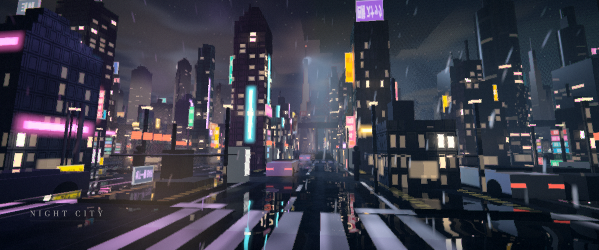
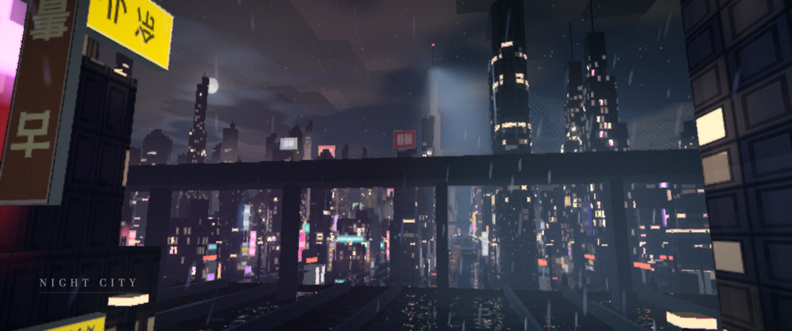

# NIGHT CITY

音频驱动的 raymarching 夜城。整座城市——楼、招牌、路面、车流、雨、雾、霓虹——都在**一个 fragment shader** 里算出来，没有一个模型文件。丢一首歌进窗口，城市跟着节拍呼吸。

**在线**：<https://jadog1122.github.io/raymarchcity/>（需要 WebGL2 桌面浏览器；打开后把 mp3 拖进窗口）





## 跑起来

- **在线**：点上面的链接。
- **本地**：`git clone` 之后直接双击 `index.html` 就能开（除 three.js 的 CDN importmap 外零依赖）。
- **带歌单**：把 mp3 放进 `music/`，`npm run scan` 生成 manifest，`npm run serve` 起本地服务，开 <http://localhost:5173>。

浏览器里拖进来的歌存在 IndexedDB 里，下次打开还在。歌词自动去 lrclib 查（对歌手，避免同名歌），也缓存在本地。

## 键位

| 键 | 作用 |
|---|---|
| `空格` | 播放 / 暂停 |
| `L` | 歌单 |
| `←` `→` | 上一首 / 下一首 |
| `F` | 全屏 |
| `S` | 存一帧 PNG |
| `R` | 录 30 秒 |
| `H` | 隐藏界面 |
| `↑` `↓` | 音量 |

右下角的画质滑块从 0.4 到 2.0。1.0 是原生分辨率，往上是超采样（好显卡上很好看，普通笔记本会掉帧）；帧率不够时它会自己往下退，但不会自己往上加。

## 是怎么画出来的

- **追踪**：8 米一格的 2D DDA 网格行走，格子里用解析 AABB / 圆柱 / 球求交。追踪器顺手把法线和材质记下来（`gHitN` / `gHitMat`），不再用 4 次 SDF 采样求梯度——这是最大的一笔性能。`?path=0` 切到参考用的 sphere tracing，`AB=1` 时 verify 会比对两条路径的像素差。
- **光**：霓虹灯管按线段做解析面光源（3 点 Gauss–Legendre + 发光面余弦 + 两点遮挡探针），所以对面的墙是真的被照亮的。
- **后期**：HDR 半浮点 RT → TAA 重投影 → 渲染分辨率合成（ACES、bloom、变形镜光条、按弥散圆门控的色差、散景景深）→ 满分辨率收尾（CAS 锐化、颗粒、文字、黑边）。
- **音频分析**：FFT 2048，谱通量起音检测，归一化自相关 + 对数正态节奏先验 + 7 点中值锁 BPM，段落检测。全部跑在独立的 60Hz 定时器上，**不挂渲染循环**。

## 开发

```
npm i          # 只装 playwright，verify 用
npm run verify # 13 张基准帧 + 真实页面冒烟 + 录屏吞吐 + 离线包检查
```

`verify` 不过就是没做完。基准帧是**一组**不是一张：工业带和霓虹街是两张完全不同的画，在其中一张上调出来的阈值对另一张一定是错的。

- `CLAUDE.md` — 硬约束和积累下来的规则
- `RETRO.md` — 每一次失败的症状 / 根因 / 修法 / 下次怎么提前避免
- `PLAN.md` — 里程碑日志

## 音乐

站上默认放的两首是 **Jadog** 的翻唱/改编：

- *Superpowers (Night Remix)* — 原曲 Daniel Caesar
- *記得 Remember (Intimate Remix)* — 原曲 張惠妹 A-Mei

录音是 Jadog 自己的，词曲版权属于原作者。打开页面点任意处就开始放第一首，也可以按 `L` 换。

把自己的 mp3 拖进窗口一样能放，存在浏览器本地，下次打开还在。

`music/` 在 `.gitignore` 里是**白名单**而不是黑名单——只有明确列出来的那两首会进仓库，别的音频和 `.lrc` 都进不来。`npm run scan` 生成的 manifest 也只列仓库真的带着的文件，不会写出一个指向 404 的歌单。

`npm run bundle` 会把音频、歌词和 three.js 全部内联进一个 `nightcity.html`，双击即可离线播放；这个文件只在本地，不进仓库。
